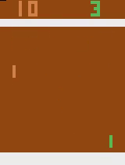

# Deep Reinforcement Learning with Keras

just clone and open the reinforcement_learning_pong_keras_policy_gradients.ipynb file
[or click here to view on github](/reinforcement_learning_pong_keras_policy_gradients.ipynb)

i trained a simple 200 hidden neuron network and a convolutional model.

sample gif playing of simple network.

video of simple network playing a game (click on image to view in youtube):

video of simple network playing a game (click on image to view in youtube):

In this short project we are gonna **train a neural network to play Pong game** using a reinforcement learning algorithm (**Policy Gradients Method - REINFORCE**). 

Considering **limited time** and for **learning purposes** I am **not aiming for a perfect trained agent**, but i hope this project could help people get familiar with basic process of rl algorithms and keras. The following video took 3 days for agent to learn on a slow computer. to obtain production results, a lot of more training and tuning is required which we is not our focus. 

prerequisites:
familiarity with neural networks,supervised learning, tensorflow and keras, openai gym

